# Tugas Kelompok Basis Data { UAS } 

|**Nama**|**NIM**|**Kelas**|**Matkul**|
|----|---|-----|------|
|Muhammad Ikhsan Fakhrudin|312210019|TI.22.A.2|Basis Data|
|Muhammad Fiqri Setyoadi|312210062|TI.22.A.2|Basis Data|
|Muhammad Verdy Hasan|312210241|TI.22.A.2|Basis Data|
|Veronika Natalia Kala|312210690|TI.22.A.2|Basis Data|
|Fergiawan Satrio Bagaskoro|312210169|TI.22.A.2|Basis Data|


- [Link Dokumentasi Presentasi](https://youtu.be/5QuRxGbY0O0)

***Jika Daftar Collaborator Belum Muncul , Silahkan Refresh 1 Sampai 2 Kali.***


# ER-Diagram


# SQL Database

```
create database TiketBus;
use TiketBus;
```

# SQL Tables

### Table Armada
```
create table Armada (
idArmada int not null primary key,
NamaArmada varchar(25),
Kapasitas varchar(10)
);

desc Armada;
```
***Output :***

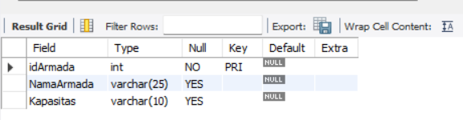

### Tabel Jadwal Berangkat
```
create table Jadwal_Berangkat (
idJadwal int not null primary key,
idArmada int not null,
Tgl_Keberangkatan date,
Jam_Keberangkatan time,
constraint FK_id_Armada foreign key (idArmada) references Armada(idArmada)
);

desc Jadwal_Berangkat;
```
***Output :***

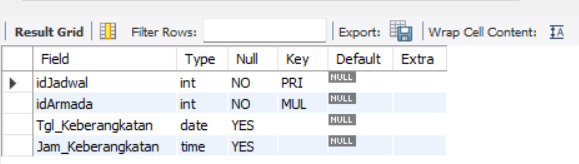

### Table Penumpang

```
create table Penumpang (
idPenumpang int not null primary key,
NamaPenumpang varchar(15),
Alamat varchar(35),
NoTelepon varchar(15),
Posisi_Tempat_Duduk varchar(5)
);

desc Penumpang;
```
***Output :***

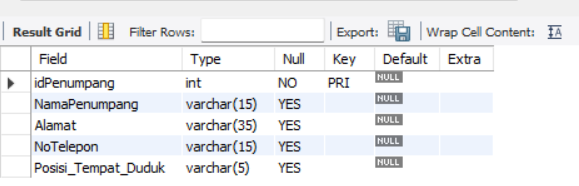

### Table Transaksi

```
create table Transaksi (
idTransaksi int not null primary key,
idArmada int not null,
idJadwal int not null,
idPenumpang int not null,
Harga bigint,
TanggalBeli date,
constraint FK_idArmada foreign key (idArmada) references Armada(idArmada),
constraint FK_id_Jadwal foreign key (idJadwal) references Jadwal_Berangkat(idJadwal),
constraint FK_id_Penumpang foreign key (idPenumpang) references Penumpang(idPenumpang)
);

desc Transaksi;
```
***Output :***

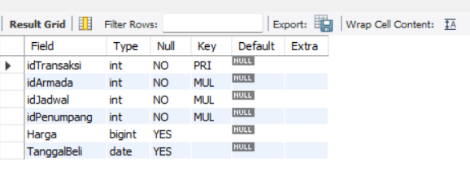

# SQL CRUD

### Table Penumpang

**CREATE + READ :**
```
insert into penumpang values
(4001, "Ikhsan", "Broadway Street No.1", "0813202301", "A1"),
(4002, "Fiqri", "Fifth Avenue Street No.1", "0813202302", "A2"),
(4003, "Verdy", "Rodeo Drive Street No.1", "0813202303", "A3"),
(4004, "Veronika", "Las Vegas Street No.1", "0813202304", "B1"),
(4005, "Fergiawan",  "Boulevard Street No.1", "0813202305", "B2"),
(4006, "C.Ronaldo", "Times Square Street No.1", "0813202306", "B3"),
(4007, "L.Messi", "Route 66 Street No.1", "0813202307", "C1"),
(4008, "R.Lewandowski", "Michigan Avenue Street No.1", "0813202308", "C2"),
(4009, "K.Mbappe", "Sunset Boulevard Street No.1", "0813202309", "C3"),
(40010, "K.Benzema", "Pennsylvania Street No.1", "0813202310", "D1");

select * from penumpang;
```

***Output :***

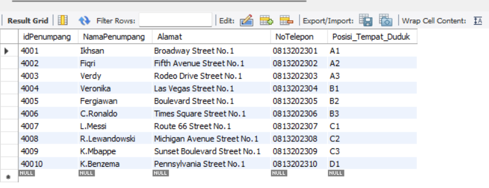

**UPDATE :**
```
update tiketbus.penumpang

set penumpang.NamaPenumpang="E.Haaland"
where idPenumpang=40010;
```

***Output :***

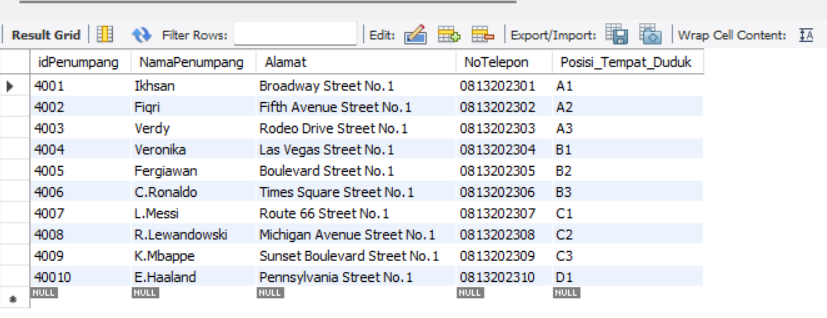

**DELETE :**
```
delete from tiketbus.penumpang where idPenumpang=40010;
```

***Output :***

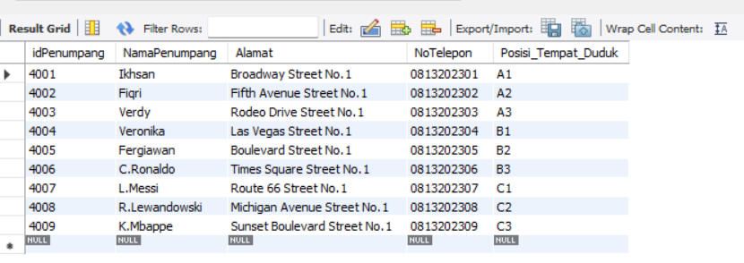

### Table Armada

**CREATE + READ :**
```
insert into armada values
(2001, "Coach USA", "50 seat"),
(2002, "Megabus", "25 seat"),
(2003, "Peter Pan Bus Lines", "50 seat"),
(2004, "Academy Bus", "25 seat"),
(2005, "Martz Trailways", "50 seat"),
(2006, "Indian Trails", "25 seat"),
(2007, "BoltBus", "50 seat"),
(2008, "RedCoach", "25 seat"),
(2009, "Valley Transit Company", "50 seat"),
(20010, "Adirondack Trailways", "25 seat");

select * from armada;
```

***Output :***

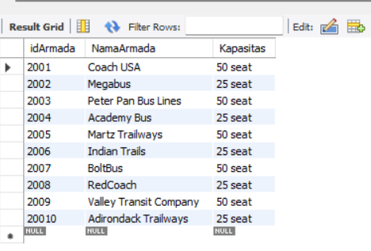

**UPDATE :**

```
update tiketbus.armada

set armada.NamaArmada="Greyhound Bus"
where idArmada=2005;
```
***Output :***

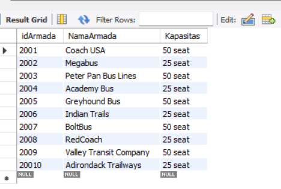

**DELETE :**

```
delete from tiketbus.armada where idArmada=20010;
```
***Output :***

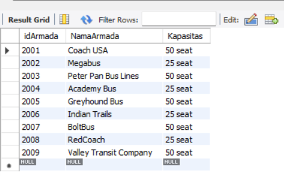

### Table Jadwal Berangkat

**CREATE + READ :**
```
insert into jadwal_berangkat values
(3001, 2001, "2023-03-03", "08:00:00"),
(3002, 2002, "2023-03-04", "08:10:00"),
(3003, 2003, "2023-03-05", "08:20:00"),
(3004, 2004, "2023-03-06", "08:30:00"),
(3005, 2005, "2023-03-07", "08:40:00"),
(3006, 2006, "2023-03-08", "08:50:00"),
(3007, 2007, "2023-03-09", "09:00:00"),
(3008, 2008, "2023-03-10", "09:10:00"),
(3009, 2009, "2023-03-11", "09:20:00"),
(30010, 20010, "2023-03-12", "09:30:00");

select * from jadwal_berangkat;
```
***Output :***

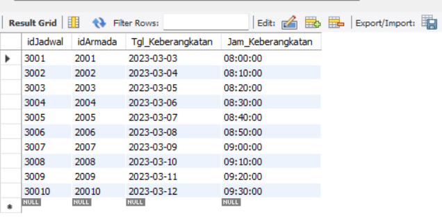

**UPDATE :**
```
update tiketbus.jadwal_berangkat

set jadwal_berangkat.Tgl_Keberangkatan="2024-04-04"
where idJadwal=30010;
```
***Output :***

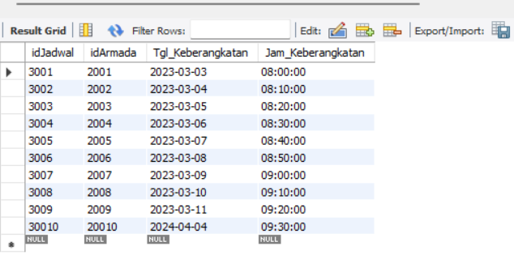

**DELETE :**
```
delete from tiketbus.jadwal_berangkat where idJadwal=30010;
```
***Output :***

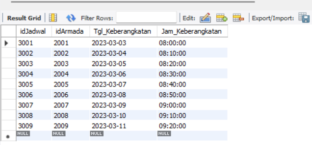

### Tabel Transaksi

**CREATE + READ :**
```
insert into transaksi values
(5001, 2001, 3001, 4001, 500000, "2023-03-03"),
(5002, 2002, 3002, 4002, 1000000, "2023-03-04"),
(5003, 2003, 3003, 4003, 500000, "2023-03-05"),
(5004, 2004, 3004, 4004, 1000000, "2023-03-06"),
(5005, 2005, 3005, 4005, 500000, "2023-03-07"),
(5006, 2006, 3006, 4006, 1000000, "2023-03-08"),
(5007, 2007, 3007, 4007, 500000, "2023-03-09"),
(5008, 2008, 3008, 4008, 1000000, "2023-03-10"),
(5009, 2009, 3009, 4009, 500000, "2023-03-11");

select * from transaksi;
```
***Output :***

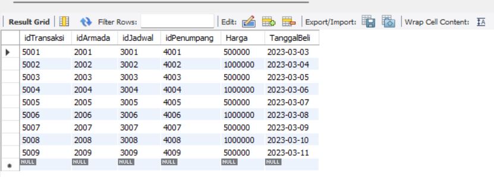

**UPDATE :**
```
update tiketbus.transaksi

set transaksi.TanggalBeli="2024-04-04"
where idTransaksi=5009;
```
***Output :***

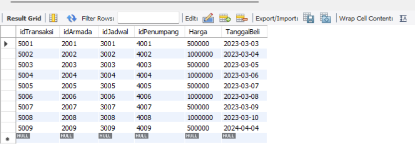

**DELETE :**
```
delete from tiketbus.transaksi where idTransaksi=5009;
```
***Output :***

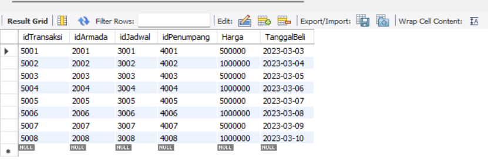

# SQL Laporan Transaksi

***Menggabungkan tabel JadwalBerangkat, Armada, dan Penumpang berdasarkan Transaksi***

- **JOIN**
```
select transaksi.idTransaksi as "ID Transaksi", jadwal_berangkat.Tgl_Keberangkatan as "Tanggal Keberangkatan", jadwal_berangkat.Jam_Keberangkatan as "Jam Berangkat",
armada.NamaArmada as "Nama Armada", penumpang.NamaPenumpang as "Nama Penumpang", penumpang.Posisi_Tempat_Duduk as "Tempat Duduk", transaksi.Harga as "Harga"

from transaksi 
join jadwal_berangkat on transaksi.idJadwal=jadwal_berangkat.idJadwal
join armada on transaksi.idArmada=armada.idArmada
join penumpang on transaksi.idPenumpang=penumpang.idPenumpang;
```
 ***Output :***

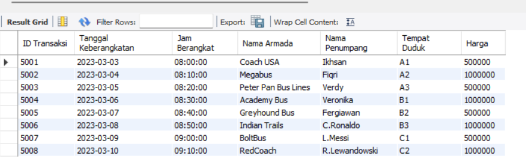

- **LEFT JOIN**
```
SELECT transaksi.idTransaksi as " ID Transaksi", armada.NamaArmada as " Nama Armada", transaksi.Harga as " Harga", 
penumpang.NamaPenumpang as " Nama Penumpang", transaksi.TanggalBeli as " Tanggal Beli"

from transaksi 
LEFT JOIN armada on transaksi.idArmada=armada.idArmada
LEFT JOIN penumpang on transaksi.idPenumpang=penumpang.idPenumpang;
```

***Output :***

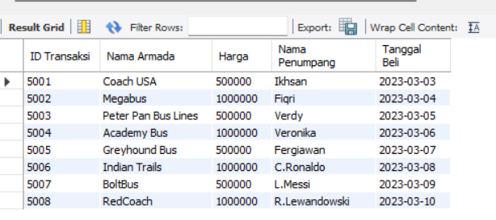

- **RIGHT JOIN**
```
SELECT transaksi.idTransaksi as " ID Transaksi", transaksi.Harga as " Harga",
armada.NamaArmada as " Nama Armada ", jadwal_berangkat.Tgl_Keberangkatan as " Tanggal Keberangkatan"

from transaksi 
RIGHT JOIN armada on transaksi.idArmada=armada.idArmada
RIGHT JOIN jadwal_berangkat on transaksi.idJadwal=jadwal_berangkat.idJadwal;
```


***Sekian Project Database Penjualan Tiket Bus Dari Kelompok Kami , Wassalamualaikum Warohmatullahi Wabarakaatuh***

## SELESAI  
